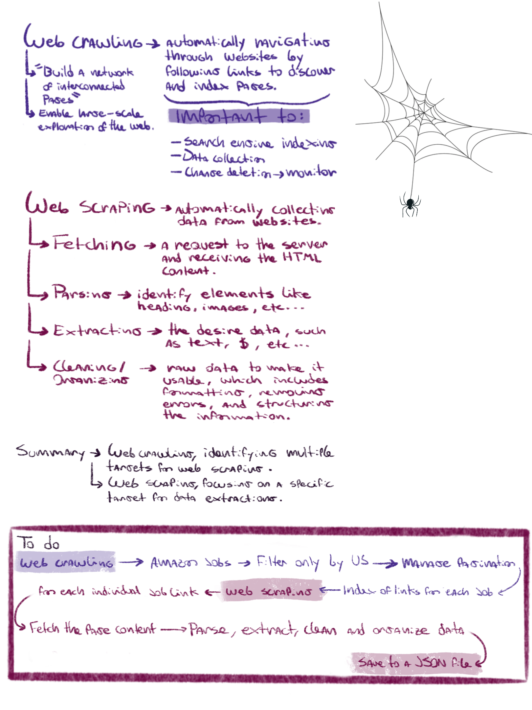
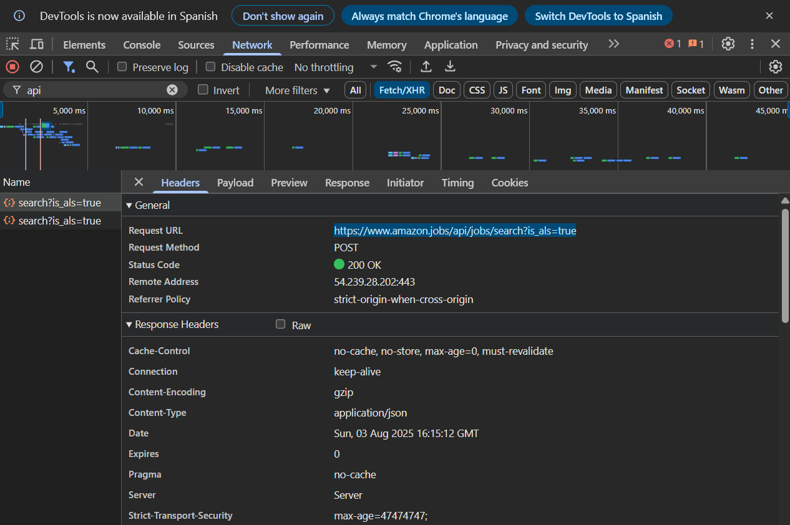

# Amazon Job Listings Scraping 🕷

Scrapes job listings from the Amazon Software Development job category page.

[Amazon jobs URL](https://www.amazon.jobs/content/en/job-categories/software-development#search)

The code to list jobs using the Scrapy framework is in: 
[`amazon_spider.py`](amazon_jobs/amazon_jobs/spiders/amazon_spider.py) and the result is stored in [`example_jobs.json`](example_jobs.json).

---

## Notes and consideretions

Scrapy → is an **application framework** for crawling websites and extracting structured data.  

While Scrapy was originally designed for **web scraping**, it also supports data extraction via **APIs** and can serve as a general-purpose **web crawler**.



During my first attempt to crawl and scrape the Amazon Jobs site using Scrapy, I noticed that the HTML of the job listings page **does not contain visible job data** like titles or links (`<a>` tags). These elements are dynamically rendered by **JavaScript**.

By inspecting the site with Chrome DevTools (specifically in the **Network** tab), I discovered that job data is loaded via an **XHR** (XMLHttpRequest) request to an internal API. This happens because modern web applications often use **AJAX techniques**, powered by `XMLHttpRequest` or the newer `fetch()` API, to asynchronously load data from the server without refreshing the page. These background requests typically return **JSON** data.

In the **Headers** tab of the request, I identified the endpoint: POST https://www.amazon.jobs/api/jobs/search?is_als=true


And in the **Payload** tab, I found the full **JSON request body** used to filter job listings.

This insight allowed me to bypass the rendered HTML and work directly with the underlying API to build a more robust and efficient spider.



### Links to Documentation and References

- [Scrapy 2.13 Documentation](https://docs.scrapy.org/en/latest)
- [Scrapy at a Glance](https://docs.scrapy.org/en/latest/intro/overview.html)  
- [Amazon Jobs – Software Development](https://www.amazon.jobs/content/en/job-categories/software-development#search)
- [XHR](https://www.w3schools.com/xml/xml_http.asp)
- [Fetch](https://www.w3schools.com/jsref/api_fetch.asp)

---

## Objective

Develop a Scrapy spider to extract job listing data from the Amazon careers page, specifically focusing on **Software Development** positions within the **United States**.

---

## Tasks

1. **Set Up Scrapy Project**  
   - Initialize a new Scrapy project (if not already done).

2. **Inspect the Target Page**  
   - Visit the [Amazon Job Categories](https://www.amazon.jobs/content/en/job-categories/software-development#search) page.  
   - Identify the structure of each job listing (e.g., title, location, link, description snippet).  
   - Apply filters to focus on **US-based jobs**.

3. **Develop the Spider**  
   Extract the following fields:
   - Job Title  
   - Location  
   - Job URL  
   - Description Snippet (if available)  
   - Last Updated (if available)

   Additionally, follow each job's detail page to extract:
   - Full Job Description  
   - Basic Qualifications  
   - Preferred Qualifications  
   - Job ID  

4. **Implement Pagination**  
   - Ensure the spider can navigate through all available pages.

5. **Save the Data**  
   - Export the data in structured **JSON** format → **jobs.json**

6. **Handle Dynamic Content (if present)**  
   - If the site uses JavaScript to render data, describe how you would approach this using Scrapy (e.g., using Splash or Selenium integration).

---

## Installation & Setup

Install Scrapy via **conda**:

Verify that you already have conda or pip in your pc!

```bash
conda install -c conda-forge scrapy
```

Or using pip:

```bash
pip install scrapy
```

To create the Scrapy project: 

```bash
scrapy startproject amazon_jobs
```

---

## Project Structure:

```markdown
amazon_jobs/ → Root directory
├── .gitignore
├── README.md
├── scrapy.cfg 
├── example_jobs.json # → Example output file from the spider
├── images/
├── amazon_jobs/
│   ├── __init__.py
│   ├── items.py
│   ├── middlewares.py
│   ├── pipelines.py
│   ├── settings.py
│   ├── __pycache__/
│   └── spiders/
│       ├── __init__.py
│       ├── __pycache__/
│       ├── amazon_spider.py # → Main spider with pagination and job count control
│       └── amazon_jobs_test.py # → Experimental spider, lacks pagination control
└── .git/
```
---